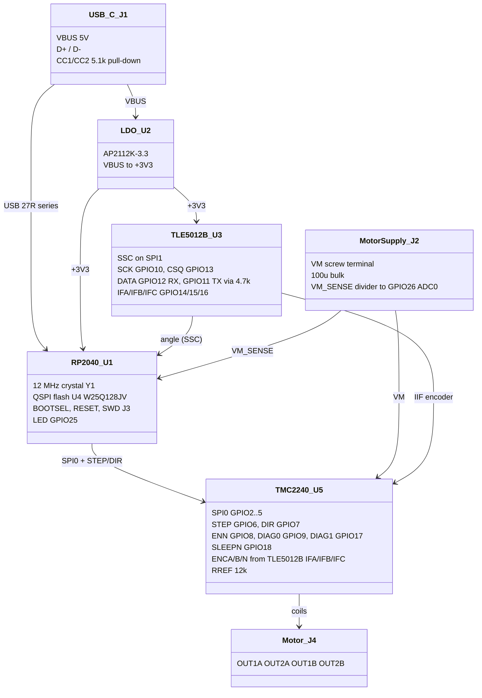

# Architecture

```mermaid
classDiagram
    class USB_C_J1 {
        VBUS 5V
        D+ / D-
        CC1/CC2 5.1k pull-down
    }
    class LDO_U2 {
        AP2112K-3.3
        VBUS to +3V3
    }
    class RP2040_U1 {
        12 MHz crystal Y1
        QSPI flash U4 W25Q128JV
        BOOTSEL, RESET, SWD J3
        LED GPIO25
    }
    class TMC2240_U5 {
        SPI0 GPIO2..5
        STEP GPIO6, DIR GPIO7
        ENN GPIO8, DIAG0 GPIO9, DIAG1 GPIO17
        SLEEPN GPIO18
        ENCA/B/N from TLE5012B IFA/IFB/IFC
        RREF 12k
    }
    class Motor_J4 {
        OUT1A OUT2A OUT1B OUT2B
    }
    class TLE5012B_U3 {
        SSC on SPI1
        SCK GPIO10, CSQ GPIO13
        DATA GPIO12 RX, GPIO11 TX via 4.7k
        IFA/IFB/IFC GPIO14/15/16
    }
    class MotorSupply_J2 {
        VM screw terminal
        100u bulk
        VM_SENSE divider to GPIO26 ADC0
    }
    USB_C_J1 --> LDO_U2 : VBUS
    USB_C_J1 --> RP2040_U1 : USB 27R series
    LDO_U2 --> RP2040_U1 : +3V3
    LDO_U2 --> TLE5012B_U3 : +3V3
    RP2040_U1 --> TMC2240_U5 : SPI0 + STEP/DIR
    TLE5012B_U3 --> RP2040_U1 : angle (SSC)
    MotorSupply_J2 --> TMC2240_U5 : VM
    TLE5012B_U3 --> TMC2240_U5 : IIF encoder
    TMC2240_U5 --> Motor_J4 : coils
    MotorSupply_J2 --> RP2040_U1 : VM_SENSE
```
