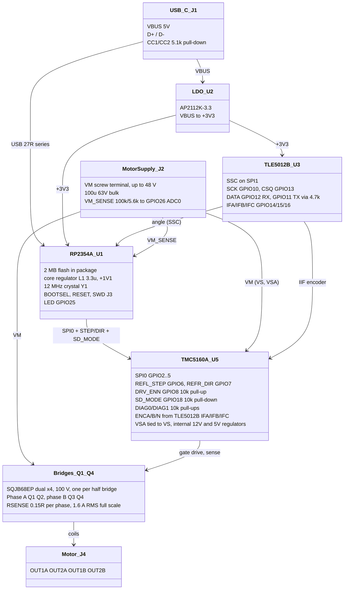

# Architecture

```mermaid
classDiagram
    class USB_C_J1 {
        VBUS 5V
        D+ / D-
        CC1/CC2 5.1k pull-down
    }
    class LDO_U2 {
        AP2112K-3.3
        VBUS to +3V3
    }
    class RP2354A_U1 {
        2 MB flash in package
        core regulator L1 3.3u, +1V1
        12 MHz crystal Y1
        BOOTSEL, RESET, SWD J3
        LED GPIO25
    }
    class TMC5160A_U5 {
        SPI0 GPIO2..5
        REFL_STEP GPIO6, REFR_DIR GPIO7
        DRV_ENN GPIO8 10k pull-up
        SD_MODE GPIO18 10k pull-down
        DIAG0/DIAG1 10k pull-ups
        ENCA/B/N from TLE5012B IFA/IFB/IFC
        VSA tied to VS, internal 12V and 5V regulators
    }
    class Bridges_Q1_Q4 {
        SQJB68EP dual x4, 100 V, one per half bridge
        Phase A Q1 Q2, phase B Q3 Q4
        RSENSE 0.15R per phase, 1.6 A RMS full scale
    }
    class Motor_J4 {
        OUT1A OUT2A OUT1B OUT2B
    }
    class TLE5012B_U3 {
        SSC on SPI1
        SCK GPIO10, CSQ GPIO13
        DATA GPIO12 RX, GPIO11 TX via 4.7k
        IFA/IFB/IFC GPIO14/15/16
    }
    class MotorSupply_J2 {
        VM screw terminal, up to 48 V
        100u 63V bulk
        VM_SENSE 100k/5.6k to GPIO26 ADC0
    }
    USB_C_J1 --> LDO_U2 : VBUS
    USB_C_J1 --> RP2354A_U1 : USB 27R series
    LDO_U2 --> RP2354A_U1 : +3V3
    LDO_U2 --> TLE5012B_U3 : +3V3
    RP2354A_U1 --> TMC5160A_U5 : SPI0 + STEP/DIR + SD_MODE
    TLE5012B_U3 --> RP2354A_U1 : angle (SSC)
    MotorSupply_J2 --> TMC5160A_U5 : VM (VS, VSA)
    MotorSupply_J2 --> Bridges_Q1_Q4 : VM
    TLE5012B_U3 --> TMC5160A_U5 : IIF encoder
    TMC5160A_U5 --> Bridges_Q1_Q4 : gate drive, sense
    Bridges_Q1_Q4 --> Motor_J4 : coils
    MotorSupply_J2 --> RP2354A_U1 : VM_SENSE
```
