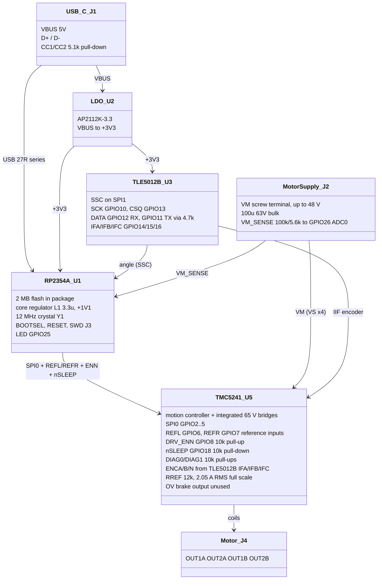
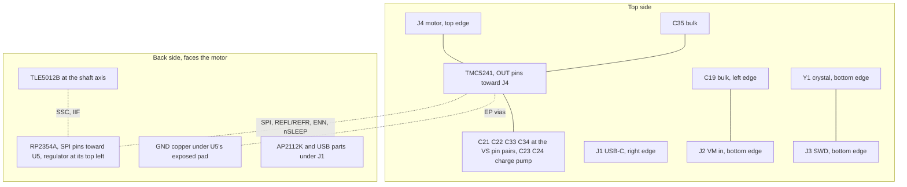

# Architecture

```mermaid
classDiagram
    class USB_C_J1 {
        VBUS 5V
        D+ / D-
        CC1/CC2 5.1k pull-down
    }
    class LDO_U2 {
        AP2112K-3.3
        VBUS to +3V3
    }
    class RP2354A_U1 {
        2 MB flash in package
        core regulator L1 3.3u, +1V1
        12 MHz crystal Y1
        BOOTSEL, RESET, SWD J3
        LED GPIO25
    }
    class TMC5241_U5 {
        motion controller + integrated 65 V bridges
        SPI0 GPIO2..5
        REFL GPIO6, REFR GPIO7 reference inputs
        DRV_ENN GPIO8 10k pull-up
        nSLEEP GPIO18 10k pull-down
        DIAG0/DIAG1 10k pull-ups
        ENCA/B/N from TLE5012B IFA/IFB/IFC
        RREF 12k, 2.05 A RMS full scale
        OV brake output unused
    }
    class Motor_J4 {
        OUT1A OUT2A OUT1B OUT2B
    }
    class TLE5012B_U3 {
        SSC on SPI1
        SCK GPIO10, CSQ GPIO13
        DATA GPIO12 RX, GPIO11 TX via 4.7k
        IFA/IFB/IFC GPIO14/15/16
    }
    class MotorSupply_J2 {
        VM screw terminal, up to 48 V
        100u 63V bulk
        VM_SENSE 100k/5.6k to GPIO26 ADC0
    }
    USB_C_J1 --> LDO_U2 : VBUS
    USB_C_J1 --> RP2354A_U1 : USB 27R series
    LDO_U2 --> RP2354A_U1 : +3V3
    LDO_U2 --> TLE5012B_U3 : +3V3
    RP2354A_U1 --> TMC5241_U5 : SPI0 + REFL/REFR + ENN + nSLEEP
    TLE5012B_U3 --> RP2354A_U1 : angle (SSC)
    MotorSupply_J2 --> TMC5241_U5 : VM (VS x4)
    TLE5012B_U3 --> TMC5241_U5 : IIF encoder
    TMC5241_U5 --> Motor_J4 : coils
    MotorSupply_J2 --> RP2354A_U1 : VM_SENSE
```

## Board floor plan

The TMC5241 stage is being placed again; this is the target arrangement.

```mermaid
flowchart TB
    subgraph top [Top side]
        J4[J4 motor, top edge] --- U5[TMC5241, OUT pins toward J4]
        U5 --- CAPS[C21 C22 C33 C34 at the VS pin pairs, C23 C24 charge pump]
        J1[J1 USB-C, right edge]
        C19[C19 bulk, left edge] --- J2[J2 VM in, bottom edge]
        C35[C35 bulk] --- U5
        Y1[Y1 crystal, bottom edge] --- J3[J3 SWD, bottom edge]
    end
    subgraph back [Back side, faces the motor]
        EP[GND copper under U5's exposed pad]
        U3[TLE5012B at the shaft axis]
        U1[RP2354A, SPI pins toward U5, regulator at its top left]
        U2[AP2112K and USB parts under J1]
    end
    U5 -. EP vias .- EP
    U5 -. SPI, REFL/REFR, ENN, nSLEEP .- U1
    U3 -. SSC, IIF .- U1
```
